# Active Directory Security Lab

Hands-on implementation and security validation of a Windows Server 2025 Active Directory environment, covering AD DS, DNS, organizational design, identity and group management, Group Policy, delegated administration, auditing, and domain security verification.

## Overview

This project documents the design, implementation, and security validation of a small Active Directory lab environment built with Windows Server 2025 and a domain-joined Windows 11 client.

The lab focuses on understanding how core Active Directory components work together in practice:

**DNS → Domain Services → Identity → Groups → OU Structure → Group Policy → Access Control → Auditing → Security Verification**

Rather than focusing only on creating a domain, the project also examines administrative scope, least privilege, Group Policy processing, delegated administration, Domain Controller health, and security logging.

---

## Lab Environment

| Component | Configuration |
|---|---|
| Domain | `lab.local` |
| NetBIOS Name | `LAB` |
| Domain Controller | `WIN-SRV2025.lab.local` |
| Domain Controller IP | `192.168.10.10` |
| Client | Windows 11 |
| Client IP | `192.168.10.20` |
| Network | `192.168.10.0/24` |
| Gateway | `192.168.10.1` |
| Client DNS | `192.168.10.10` |
| Server Roles | Active Directory Domain Services, DNS |
| Virtualization | Microsoft Hyper-V |

---

## Objectives

The main objectives of the lab were to:

- Verify Active Directory Domain Services and DNS functionality.
- Design a structured Organizational Unit hierarchy.
- Create and organize domain users and security groups.
- Apply the AGDLP model for scalable permission management.
- Join a Windows 11 client to the Active Directory domain.
- Implement and verify Computer and User Group Policies.
- Understand GPO scope, inheritance, precedence, and security filtering.
- Review privileged Active Directory groups.
- Implement delegated administration using least privilege.
- Identify and verify FSMO roles.
- Validate Domain Controller health.
- Inspect SYSVOL and NETLOGON.
- Review Active Directory and security-related event logs.
- Verify auditing of account and group membership changes.
- Identify security risks and areas for improvement.

---

## Active Directory Structure

The environment was organized using a dedicated `LAB` OU with separate organizational units for users, departments, computers, servers, groups, administrative accounts, and delegation testing.

```text
lab.local
└── LAB
    ├── Users
    │   ├── IT
    │   ├── Finance
    │   └── Sales
    ├── Workstations
    ├── Servers
    ├── Groups
    ├── Admin
    └── Helpdesk-Test
```

This structure provides clear separation between object types and departments while allowing Group Policy and delegated permissions to be applied at appropriate levels.

---

## Identity and Group Management

Domain users were created and organized according to department.

| Department | Users |
|---|---|
| IT | Erik Ek |
| Finance | Sara Svensson, Lisa Lind, Anna Andersson |
| Sales | Johan Jansson, Oskar Olsson |

A separate administrative account was also created:

```text
adm-anna.andersson
```

Using separate standard and administrative accounts reduces unnecessary exposure of privileged credentials during normal user activity.

### Security Groups

The following security groups were used:

```text
GG-IT-Users
GG-Finance-Users
GG-Sales-Users
GG-Helpdesk
DL-Finance-Read
```

The design separates user membership from resource permissions and provides a foundation for scalable access management.

---

## AGDLP

The lab demonstrates the Microsoft AGDLP permission model:

```text
Accounts
   ↓
Global Groups
   ↓
Domain Local Groups
   ↓
Permissions
```

Example:

```text
Sara Svensson / Lisa Lind
          ↓
GG-Finance-Users
          ↓
DL-Finance-Read
          ↓
Read Permission
```

`GG-Finance-Users` was nested inside `DL-Finance-Read`.

The final resource permission represents the intended permission design; a production file-share permission was not configured as part of this lab.

---

## Windows 11 Domain Integration

The Windows 11 client was configured to use the Domain Controller as its DNS server:

```text
DNS: 192.168.10.10
```

DNS resolution was verified before the client was joined to:

```text
lab.local
```

After the successful domain join, the computer account was moved to:

```text
LAB
└── Workstations
    └── W11-CLIENT
```

Domain authentication was then tested using domain user accounts.

Correct DNS configuration is critical because Active Directory clients rely on DNS and SRV records to discover Domain Controllers and domain services.

---

## Group Policy Implementation

Several Group Policy Objects were created to test computer configuration, user configuration, scope, inheritance, and policy precedence.

### SEC-W11-Basic-Security

Linked to:

```text
LAB → Workstations
```

Configured setting:

```text
Computer Configuration
└── Windows Settings
    └── Security Settings
        └── Local Policies
            └── Security Options
                └── Interactive logon:
                    Do not display last signed-in
```

The policy was verified on the Windows 11 client using:

```powershell
gpupdate /force
gpresult /scope computer /r
gpresult /h C:\gpresult.html /f
```

---

### CFG-Users-Basic

A User Configuration policy was created to restrict access to Control Panel and PC settings.

The policy was used to demonstrate OU-based targeting.

Testing showed:

```text
Anna Andersson → Finance → Restricted
Erik Ek        → IT      → Not restricted
```

This demonstrated how OU placement affects Group Policy scope.

---

## GPO Security Filtering

A separate test policy was created:

```text
SEC-Finance-Test
```

It was linked to the Finance OU and Security Filtering was configured using:

```text
GG-Finance-Users
```

This demonstrated how Group Policy scope can be further restricted using security group membership.

The policy was used to study filtering behavior; no separate production security setting was implemented through this test GPO.

---

## GPO Inheritance and Precedence

Two test policies were created to examine Group Policy processing:

```text
TEST-Domain-Setting
TEST-OU-Setting
```

Both configured the same harmless setting with different values.

One policy was linked at the domain level and the other to the Workstations OU.

The test demonstrated the normal Group Policy processing model:

```text
Local
  ↓
Site
  ↓
Domain
  ↓
Organizational Unit
```

The Windows 11 client reported:

```text
VerboseStatus = 1
```

which matched the OU-level configuration.

This demonstrated how a policy linked closer to the target object can take precedence when conflicting settings are processed under normal inheritance rules.

---

## Privileged Group Review

Privileged Active Directory groups were reviewed, including:

```text
Domain Admins
Enterprise Admins
Schema Admins
```

At the time of verification, only the built-in `Administrator` account was observed in these privileged groups.

No unnecessary privileged memberships were added during the lab.

Restricting privileged group membership is an important part of reducing administrative attack surface.

---

## Delegated Administration

A dedicated Helpdesk security group was created:

```text
GG-Helpdesk
```

A test account was added:

```text
helpdesk.test
```

The group received limited delegated permissions over the user environment.

The delegated tasks included:

- Reset user passwords.
- Require password change at next logon.

RSAT Active Directory management tools were installed on the Windows 11 client to test administration without requiring normal Helpdesk users to log on directly to the Domain Controller.

### Delegation Verification

Two actions were tested using the Helpdesk account:

| Action | Result |
|---|---|
| Reset a user's password | Allowed |
| Add a user to Domain Admins | Denied |

The test demonstrated the principle of **Least Privilege**:

> Administrative users should receive only the permissions required to perform their assigned tasks.

---

## FSMO Roles

FSMO role placement was verified using:

```powershell
netdom query fsmo
```

All five roles were hosted by the single Domain Controller:

```text
Schema Master
Domain Naming Master
PDC Emulator
RID Master
Infrastructure Master
```

This is expected in the current single-DC lab environment.

---

## Domain Controller Health

Domain Controller health was examined using:

```powershell
dcdiag
```

Several core tests passed, including:

```text
Connectivity
NetLogons
SysVolCheck
Replications
Services
```

The following tests reported issues:

```text
Advertising
SystemLog
LocatorCheck
```

Further investigation identified time synchronization as an important issue.

The status was checked using:

```powershell
w32tm /query /status
```

The Domain Controller reported:

```text
Leap Indicator: 3 (not synchronized)
Source: VM IC Time Synchronization Provider
```

The time synchronization issue remains an identified improvement area.

---

## Replication Check

Replication status was inspected using:

```powershell
repadmin /replsummary
```

Because the environment currently contains only one Domain Controller, there are no additional Domain Controllers with which to perform AD replication.

The command is still useful as part of the validation workflow and would become significantly more important if a second Domain Controller were introduced.

---

## SYSVOL and NETLOGON

The Domain Controller shares were verified:

```text
\\WIN-SRV2025\SYSVOL
\\WIN-SRV2025\NETLOGON
```

SYSVOL contained the expected domain policy structure, including:

```text
lab.local
└── Policies
```

SYSVOL is critical to Group Policy because Domain Controllers use it to provide policy files and scripts to domain clients.

No SYSVOL files were manually modified.

---

## Security Auditing

Windows Event Viewer was used to inspect Active Directory and operating system activity.

Logs reviewed included:

```text
Directory Service
DNS Server
Security
System
DFS Replication
```

A temporary account named:

```text
logg.test
```

was created, added to `GG-IT-Users`, and then deleted.

The corresponding security events were successfully identified.

| Event ID | Description |
|---|---|
| 4720 | User account created |
| 4728 | Member added to a security-enabled global group |
| 4726 | User account deleted |

The events could be correlated to the same test account.

This demonstrates how Windows security auditing can provide visibility into identity and group membership changes inside Active Directory.

---

## Security Findings

The lab identified several areas that would require further attention in a production environment.

| Area | Finding |
|---|---|
| Domain Controller redundancy | Only one Domain Controller currently exists |
| Time synchronization | Domain Controller reported an unsynchronized state |
| Backup and recovery | Full AD recovery capability was not verified |
| DNS | Historical DNS warnings require follow-up |
| Password policy | Effective password policy requires further verification |
| Privileged access | Privileged group membership was restricted during testing |
| Delegation | Least-privilege Helpdesk administration was successfully demonstrated |
| Logging | Account and group changes were successfully audited |

---

## Recommended Improvements

The next improvements for the environment would include:

1. Deploy a second Domain Controller for redundancy.
2. Configure and verify a reliable time synchronization hierarchy.
3. Implement and test Active Directory backup and recovery procedures.
4. Investigate historical DNS warnings and verify long-term DNS health.
5. Verify the effective domain password and account lockout policies.
6. Continue reviewing privileged group membership.
7. Expand security auditing and centralized monitoring.

A possible second Domain Controller design is:

```text
Hostname: WIN-SRV2025-DC02
IP:       192.168.10.11
Roles:    AD DS + DNS
```

This represents a proposed future improvement and was not deployed during the current lab.

---

## Key Takeaways

The lab demonstrates how the major Active Directory components work together:

```text
DNS
 ↓
Active Directory Domain Services
 ↓
Identity
 ↓
Users + Computers
 ↓
Groups
 ↓
Organizational Units
 ↓
Group Policy
 ↓
Access Control
 ↓
Auditing
 ↓
Security Verification
```

The most important lessons from the lab were:

- DNS is fundamental to Active Directory service discovery.
- OU design determines administrative and Group Policy scope.
- Groups should be used for scalable permission management.
- GPOs should be targeted carefully instead of being applied broadly.
- Administrative privileges should follow least-privilege principles.
- Delegation can provide administrative capability without Domain Admin rights.
- Group Policy must be verified on the target system, not only in GPMC.
- Active Directory changes should be logged and auditable.
- Domain Controller health, time synchronization, DNS, and redundancy are critical to a reliable AD environment.

---

## Repository Structure

```text
active-directory-security-lab/
├── docs/
│   └── lab-documentation.md
├── images/
│   └── ...
└── README.md

```

## Screenshots

### Active Directory OU Structure

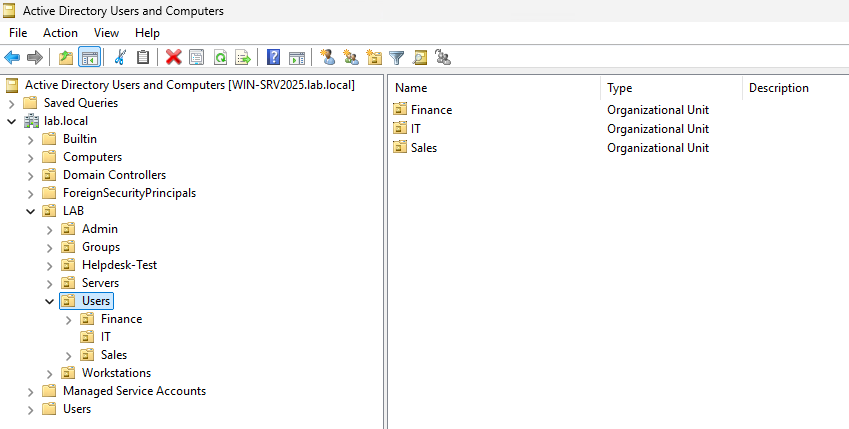

*Active Directory organizational structure for the `lab.local` domain, separating administrative accounts, security groups, helpdesk testing, servers, users, departmental OUs, and domain workstations.*

### Active Directory Users and Security Groups

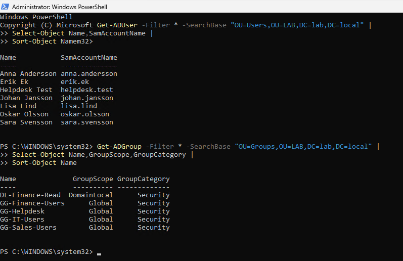

*PowerShell enumeration of domain users and security groups within the LAB structure, including Global security groups and the Domain Local group used for the AGDLP access model.*

### Windows 11 Domain Membership

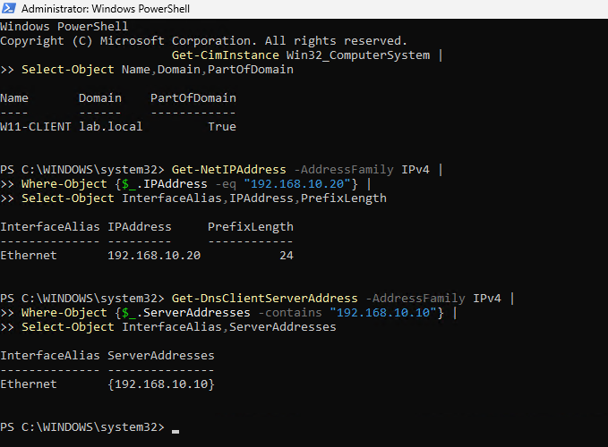

*Windows 11 client verification showing successful membership in `lab.local`, the configured `192.168.10.20/24` address, and the Domain Controller at `192.168.10.10` as the DNS server.*

### Workstation Security Group Policy

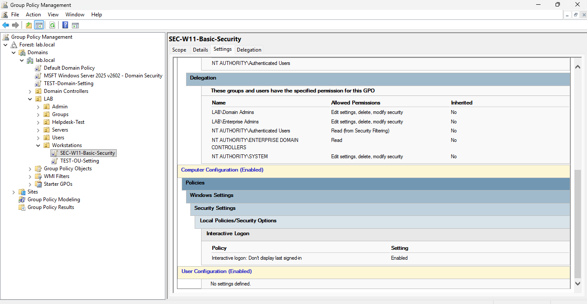

*Workstation security GPO configuration showing `SEC-W11-Basic-Security` applied to the Workstations OU with the interactive logon policy configured to hide the last signed-in user.*

### User Group Policy Scope

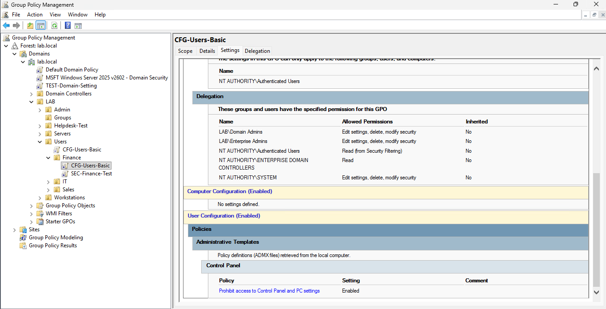

*User-based Group Policy configuration showing `CFG-Users-Basic` scoped to the Finance OU and configured to prohibit access to Control Panel and PC settings.*

### Group Policy Result Verification

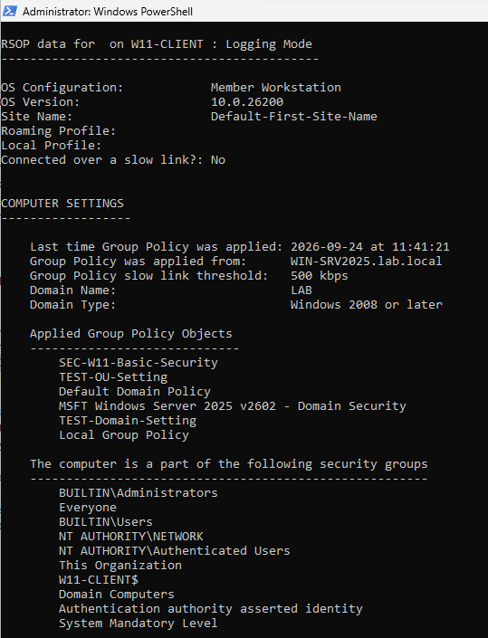

*`gpresult` verification on `W11-CLIENT` confirming that `SEC-W11-Basic-Security` and other applicable domain policies were successfully processed from `WIN-SRV2025.lab.local`.*

### Helpdesk Delegation and Least Privilege

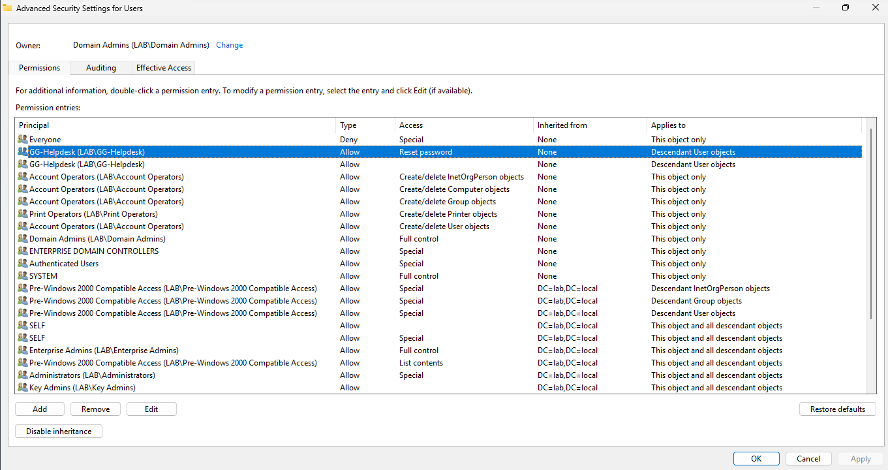

*Delegated permissions for `GG-Helpdesk`, allowing password resets on descendant user objects without granting broad administrative privileges.*

### FSMO Role Verification

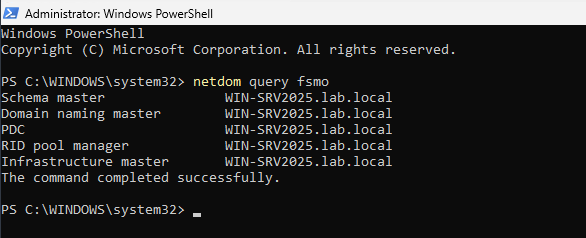

*FSMO role verification using `netdom query fsmo`, confirming that all five Active Directory operations master roles are currently held by `WIN-SRV2025.lab.local`.*

### Domain Controller Advertising Diagnostic

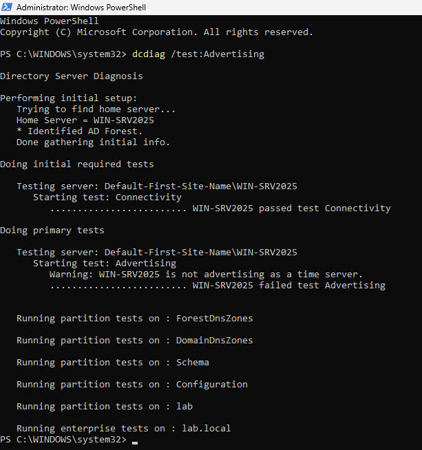

*Targeted `dcdiag` test confirming Domain Controller connectivity while identifying that `WIN-SRV2025` is not currently advertising as a time server.*

### Domain Controller Time Synchronization Status

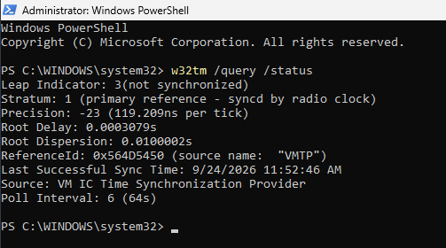

*Windows Time Service status showing the Domain Controller as not synchronized and using the Hyper-V VM IC Time Synchronization Provider as its current time source.*

### Active Directory Security Auditing

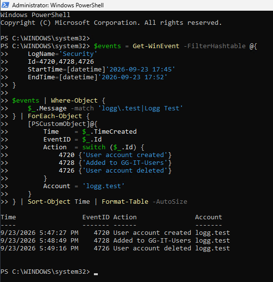

*Security log verification showing the lifecycle of the temporary `logg.test` account: account creation (Event ID 4720), addition to `GG-IT-Users` (Event ID 4728), and account deletion (Event ID 4726).*

## Documentation

Detailed technical documentation, implementation steps, commands, validation results, and troubleshooting are available here:

[**Lab Documentation**](docs/lab-documentation.md)

---

## Disclaimer

This project was created in an isolated lab environment for educational and cybersecurity training purposes. It does not represent a production Active Directory deployment.

---

## Author

**Muhammad Mehdi**

IT Security Developer Student
